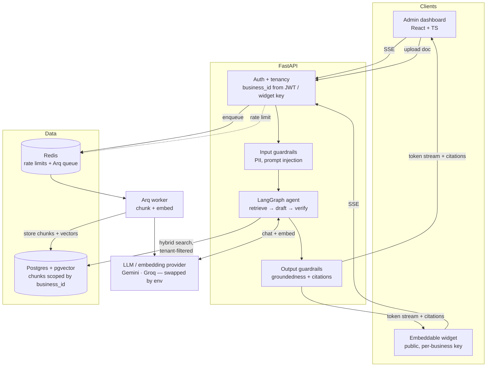

# Multi-Tenant RAG Chatbot Platform

A super-admin manages multiple businesses from one dashboard. Each business admin uploads
documents into an isolated knowledge base and gets a dedicated chatbot — dashboard chat +
an embeddable public widget — that answers only from that business's own documents, with
citations. Built provider-agnostic: chat/embedding LLMs are swapped via env vars, no code
changes (see `platform-backend/src/llm/`).

The engineering standards each half is held to are committed alongside the code:
`platform-backend/CLAUDE.md` and `platform-frontend/CLAUDE.md` summarize them, and the full
rules live in `.claude/skills/` in each folder (security baseline, RAG retrieval, agent
loop, guardrails, and eval standards).

## Packages

- `platform-backend/` — FastAPI + LangGraph + LlamaIndex + pgvector
- `platform-frontend/` — React + TypeScript admin dashboard, plus `widget/` (embeddable
  chat widget bundle)

## Architecture

A chat turn is a bounded LangGraph loop that must ground its answer in this tenant's
documents before it is allowed to return.



Two invariants hold the design together: **`business_id` is never read from the client** —
it is derived from the authenticated principal or a validated widget key, and it filters
every query and vector search; and **no vendor LLM SDK appears in business logic** —
everything goes through the `src/llm/base.py` Protocols, so switching providers is an env
change (see [Provider switching](#provider-switching)).

## Quickstart (Docker Compose)

```bash
cp platform-backend/.env.example platform-backend/.env       # fill in real secrets
cp platform-frontend/.env.example platform-frontend/.env.local

docker compose up -d postgres redis   # wait for both healthy
docker compose up -d api worker frontend
```

- API: http://localhost:8000 (health check: `GET /health`)
- Dashboard: http://localhost:5173
- Postgres: localhost:5432 (`platform`/`platform`)
- Redis: localhost:6379

`docker compose ps` should show all five services `Up`/`healthy`. Backend migrations
(Alembic) run automatically on API container start.

## Running it live (with a real API key)

The steps below reproduce the full end-to-end demo: create a business → upload a doc →
Gemini embedding → hybrid retrieval → grounded, cited chat answer. The defaults in
`platform-backend/.env.example` are the verified free-tier Gemini setup, so the only
secret you must supply is a Gemini API key.

### 1. Get a Gemini API key

Create a free key at https://aistudio.google.com/apikey and put it in
`platform-backend/.env`:

```bash
GEMINI_API_KEY=your-key-here
```

(The `.env.example` defaults already select `gemini-flash-latest` for chat and
`gemini-embedding-001` for embeddings — no other changes needed.)

### 2. Bring up the stack

```bash
docker compose up -d          # postgres, redis, api, worker, frontend
```

### 3. Create a super-admin

```bash
docker compose run --rm api python scripts/create_superadmin.py <email> <password>
```

### 4. Drive it from the dashboard

1. Open http://localhost:5173 and log in as the super-admin.
2. Create a business, then invite a business admin (email + password).
3. Log out, log back in as the business admin.
4. Upload a `.txt` / `.md` / `.pdf` / `.docx` document and wait for its status to reach
   **ready** — ingestion (chunk + Gemini embed) runs in the worker container.
5. Ask a question in the chat and get a grounded answer with citations.

> A grounded turn takes ~15-20s: `gemini-flash-latest` is a 2.5-class "thinking" model.
> That latency is expected, not a hang.

### 5. Or drive it via the API (curl)

All confirmed against the running stack. Login returns `access_token`; the chat endpoint
streams Server-Sent Events.

```bash
# Log in as the super-admin -> capture the token
SUPER=$(curl -s http://localhost:8000/auth/login \
  -H 'Content-Type: application/json' \
  -d '{"email":"<super-email>","password":"<super-pass>"}' | jq -r .access_token)

# Create a business -> capture its id
BID=$(curl -s http://localhost:8000/businesses \
  -H "Authorization: Bearer $SUPER" -H 'Content-Type: application/json' \
  -d '{"name":"Acme Inc"}' | jq -r .id)

# Invite a business admin for that business
curl -s http://localhost:8000/businesses/$BID/admins \
  -H "Authorization: Bearer $SUPER" -H 'Content-Type: application/json' \
  -d '{"email":"admin@acme.test","password":"supersecret"}'

# Log in as the business admin -> capture the token
ADMIN=$(curl -s http://localhost:8000/auth/login \
  -H 'Content-Type: application/json' \
  -d '{"email":"admin@acme.test","password":"supersecret"}' | jq -r .access_token)

# Upload a document (multipart; field name is "file")
curl -s http://localhost:8000/businesses/$BID/documents \
  -H "Authorization: Bearer $ADMIN" \
  -F 'file=@handbook.pdf'

# Poll until the document status is "ready" (pending -> processing -> ready)
curl -s http://localhost:8000/businesses/$BID/documents \
  -H "Authorization: Bearer $ADMIN" | jq '.[].status'

# Ask a question — streams SSE (business_id is derived from the JWT, never the body)
curl -N http://localhost:8000/chat \
  -H "Authorization: Bearer $ADMIN" -H 'Content-Type: application/json' \
  -d '{"message":"What is the refund policy?"}'
```

The chat stream emits token frames followed by a final done frame with citations:

```
data: {"token":"Our "}
data: {"token":"refund "}
data: {"token":"policy ..."}
data: {"done":true,"citations":[{"doc_id":"...","title":"handbook.pdf"}]}
```

### Free-tier model notes

Two walls the live run hit on real free-tier keys, already worked around in the
`.env.example` defaults:

- **Embeddings:** `text-embedding-004` returns **404** on the current Gemini API. Use
  `EMBED_MODEL=gemini-embedding-001`. It defaults to 3072 dims but is truncated to 768
  (via `output_dimensionality`) to match the pgvector column — keep `EMBED_DIM=768`.
- **Chat:** some free-tier keys have **zero** generateContent quota for `gemini-2.0-flash`
  and `gemini-2.0-flash-lite` (`429 RESOURCE_EXHAUSTED`, `limit: 0`).
  `gemini-flash-latest` works — that's the default for both `LLM_MODEL` and
  `LLM_FALLBACK_MODEL`.

## Provider switching

The chat/embedding LLMs go through provider abstractions (`platform-backend/src/llm/`), so
swapping providers is a pure `.env` change — no code edits. For example, to move chat from
Gemini to Groq (faster), set:

```bash
LLM_PROVIDER=groq
LLM_MODEL=llama-3.3-70b-versatile
GROQ_API_KEY=your-groq-key
```

Restart the `api` and `worker` containers and the platform uses Groq — everything else
(retrieval, citations, guardrails) is unchanged.

## Development

- Backend lint/type-check: `docker compose exec api ruff check src && docker compose exec api mypy src`
- Frontend lint/type-check/build: `cd platform-frontend && npm run lint && npm run typecheck && npm run build`
- Both `src/` directories are bind-mounted into their containers for live reload during
  development.

## Testing

### Backend — pytest (285 tests, 86% line coverage)

Tests run **inside the `api` container against the real Postgres and Redis** started by
`docker-compose.yml`. There is no test-only database and no rollback fixture: isolation
comes from suffixing every seeded row with `uuid4().hex[:8]` (see the docstring in
`platform-backend/tests/conftest.py`). Bring the stack up first — `postgres` and `redis`
must be `healthy`.

```bash
docker compose up -d postgres redis api          # required: tests hit the real DB
docker compose exec api pytest -q                # full suite (~70s)
docker compose exec api pytest -q -m "not slow"  # skips the fastembed ONNX model download
docker compose exec api pytest --cov=src --cov-report=term-missing
docker compose exec api ruff check src tests
docker compose exec api mypy src tests           # strict mode covers the test suite too
```

No test ever calls a live LLM. Chat, embedding, and reranker providers are all behind the
`src/llm/base.py` Protocols, so tests inject hand-written duck-typed fakes, or monkeypatch
at the import site (`monkeypatch.setattr("src.chat.service.run_agent", ...)`).

### Frontend — vitest (217 tests)

```bash
cd platform-frontend
npm install                  # first run only
npm test                     # full suite, incl. widget/ (~17s)
npm run test:coverage        # summary in the terminal; HTML report path is printed
npm run typecheck
npm run lint
```

Tests are colocated (`Foo.test.tsx` beside `Foo.tsx`) and mock the API-client module
rather than `fetch`, so they stay decoupled from transport. `widget/src` is included in the
vitest run *only* — its eslint, tsc, and vite build isolation is unchanged.

### LLM quality gates

Correctness and red-team suites are declarative and need a running stack plus a real API
key. These are the regression gate for any prompt, model, or retrieval change:

```bash
cd platform-backend && npx promptfoo@latest eval -c promptfooconfig.yaml
docker compose exec api python scripts/eval_retrieval.py --min-precision 0.6 --min-recall 0.6
```

## License

[MIT](LICENSE).
